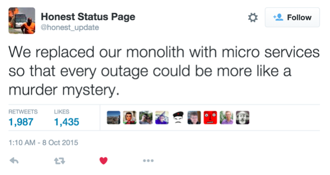

{
	"title": "A case for microservices",
	"template": "../inc/arbitrary-page.template.source"
}
---

_This article was originally delivered as the opening talk at [dotGo](http://dotgo.eu), Paris, November 2015.   Video coming soon._

&mdash;&nbsp;&ndash;&nbsp;-

I want to make a case for microservices.
I think they represent something really powerful, in a similar way that Go represents something powerful.
But I'm not going to make a technical case.
Because, on technical grounds, microservices are pretty crummy.

## Downsides of microservices

If you've ever run microservices in production, you know these downsides intimiately.

Distributed systems are necessarily vulnerable to a huge class of failure modes.
Ones you can think of, like machines being down, or network links being saturated.
But plenty of ones you probably won't think of, like asymmetric partitions, or TCP retransmission errors.
Even things you'd like to think were impossible, like out-of-order delivery.
And when things go well, you still take a huge performance hit.
Function calls measured in nanoseconds become RPCs measured in milliseconds.

Architecturally, you struggle to delineate boundaries, and there's often not a right answer.
You tend to end up with code duplication.
And that code isn't necessarily bound by language, making proficiency difficult.

When you start testing things get really hairy.
To test your site you need to herd sixty cats into an integration environment.
You need some way of specifying which versions are supposed to work with each other.
And once you've accomplished that impossible task, you need to write a system test that's actually reliable.
And then you need to wire it into a continuous integration pipeline.
And of course you're continuously deploying, right?

Operationally things are perhaps worst of all.
What used to be a single artifact in motion is now a probability cloud of actors.
What version is production? All of them. All the versions.
Deployment tooling becomes critical, and you realize that yours isn't actually very good.
Or, worse, each microservice is deployed differently, perhaps even incompatibly to the same target.
You want to pack multiple services per host for utilization... but then you have noisy neighbors.
So you implement quotas... but then the OOM killer wreaks havoc on your underspecified jobs.

## Downsides of Go

In a very similar way, I think there are downsides of Go.
Lord knows if you read Hacker News for more than a microsecond, you'll find out about each of them.

We've repeated the billion dollar mistake, and have nil pointers.
We have no templated types.
We have no macros.
We have no inheritance.
We have restricted access to memory.
Our error handling is verbose.
For many domains, being garbage collected is a showstopper.
These are all, in some sense, costs.

## Upsides of Go

But there are benefits that follow directly from these costs.
Chief among them, in my view, is the richness of Go's tooling.
gofix, go fmt, go vet, golint, the gocode autocompletion daemon, the Go Oracle.
All rely, to some degree, on the sparsity of the underlying language.
Not that these things would be impossible otherwise, but that they would be much harder.
The presence of macros in Rust, for example, make it very difficult to effectively and efficiently produce and manipulate ASTs.
Which, in turn, makes a Rust autocompletion daemon a tricky prospect.

In losing inheritance in favor of composition, or structural subtyping, we actually eliminate entire classes of design errors.
Similarly, we lose threads but gain goroutines, and eliminate classes of concurrency errors.
The distillation of [errors to mere values](https://blog.golang.org/errors-are-values) increases verbosity, but seems to make us more thoughtful, and our code more resilient.

These benefits are perhaps dissatisfying to someone walking a feature checklist.
But Go programmers understand that they are real and powerful things.
Go's ethos is a certain, quixotic, sometimes polarizing, structural simplicity.
Which, in turn, enables a host of higher-order virtues, improving programming in the large.

## Upsides of microservices

Microservices impose real, often underestimated costs.
But I think those costs can actually be thought of as virtuous constraints.
When you design a distributed system, you open yourself up to a lot of errors.
But it's a lot better to defend against those errors from day 1, than to try to bolt a defense on to an existing system later.
And in our zeitgeist, you're going to have to think distributed at some point.

When function calls are RPCs you think carefully about your APIs, aiding encapsulation.
Code duplication and multiple languages enable experimentation, and suitability for purpose.
Difficult end-to-end tests force an investment in unit and integration testing, which is correct.
An increased emphasis on deployment automation is painful in the short-term, but a game-changer in the long term.
And forcing teams to think carefully about consumer-driven contracts and responsibility boundaries brings all the benefits of spec-driven development.

In fact, I think the single exemplary virtue of microservices is...

## The bounded context

It comes from domain-driven-design.
There it's a business context: a microservice should map to a business domain, not a technical domain.
[Martin Fowler describes](http://martinfowler.com/bliki/BoundedContext.html) nouns with subtly different definitions across contexts: _polysemes_.
Each context implements its own consistent view of a polyseme, and defines mappings for other contexts as appropriate.

Bounded contexts also hide implementation details like databases, and promote encapsulation.
They nudge you toward an active object or message-passing architectural model, which is rational, coherent, understandable.
Services exist to be called, do work independently, without side effects, and yield results synchronously.

Sounds a lot like good Go API design.
Indeed, as Go promotes virtues at the language level, I'd like to argue that microservices promote virtues at the architecture level.
But I'm using virtue very vaguely here.
What make software virtuous?
Or...

## What even is software?

One definition I like is by a guy called Dan North.
He says that the goal of software development is to [sustainably minimize lead time to business impact](http://www.infoq.com/presentations/microservices-replaceability-consistency).
Importantly, it is **not** to produce software.
Code is not an asset, but rather a cost.
We should be optimizing for code that has a short half-life and can be easily destroyed.
Ultimately the most important virtue of software, in itself, is mutability.

Good software is software that adapts to its environment.
Or, as Andrew Gerrand put it in 2012, [code that grows with grace](https://talks.golang.org/2012/chat.slide#1).
Because, as we know, software is never finished.
How do we enable mutability?
Confidence.
We give ourselves confidence to mutate.
As programmers, we all _want_ to do it -- we _want_ to program.
We got into this profession because we believe in the virtue of creation.
Our tools should help us do that.
Our tools should give us confidence.
And from confidence comes happiness.

## Happiness

Let's pick things that make us happy.
And I mean happiness in the Epicurian sense: [ataraxia](https://en.wikipedia.org/wiki/Ataraxia) -- freedom from worry, enabled by the pursuit of virtues.

Our architecture should allow us quick iterations, low-risk experimentation, and continuous refactoring.
As Dan North puts it, microservices allow us to write code that fits in our head.
Our language should allow us to understand quickly, and make changes authoritatively.
Go's small surface area, and orthogonal features, allow us to know what we're doing.

I love Go for this, I think all Go programmers do.
Go is a language that lets me confidently express myself, without doubt of the unknown.
And I love microservices for this.
They let me experiment, build and re-build, freely engage in the act of creation.
From idea to product, a solution that's a perfect fit for the problem.

## Go kit

I'm working on this project to make microservices in Go a nicer experience.
[Go kit](https://gokit.io) is a toolkit for writing microservices in Go.
It collects necessary stuff like circuit breakers, instrumentation, and adapters to different transports.
It defines ways of structuring applications that are safe, performant, and adaptable to different needs.
It reflects a lot of experience running microservices in production.
And I hope it can help some people.

Specifically, I hope it can help those of us in larger organizations, which may be more resistant to change.
In smaller companies, startups, it's often very easy to make an experiment.
Try a new language, a new way of deploying code, see where it gets you.
But in larger companies, enterprise-scale companies, there's often a natural resistance to change.
Calcified process, that grows organically, but can inhibit progress -- and happiness.
I created Go kit as a method of addressing that resistance.
Something you can bring to your engineering director, and say "we can do this, it's legitimate!"

I'm being very deliberate, growing it slowly, with careful thought.
And I'm very interested in helping those of you who might benefit from it.
So take a look if this might be able to help you.
And contribute, if this area is interesting to you.
I hope it will create some happiness in the world.

## Happiness

Thank you to the Go authors for giving me a tool that makes me happy.
Thank you to the other [dotGo speakers](http://dotgo.eu) for sharing what makes them happy.
I hope that my hope, my talk of happiness, has made you are a little happier, too.
Thank you for reading.
