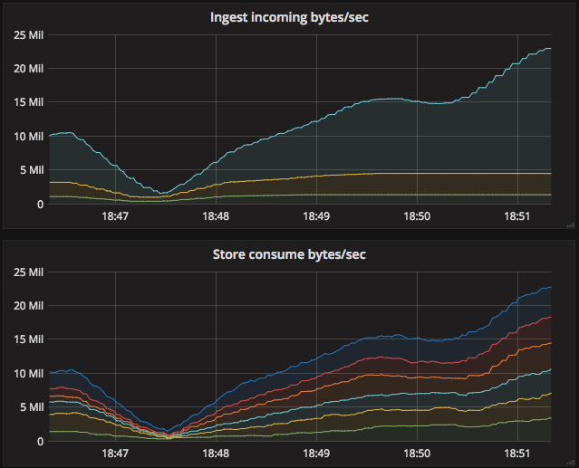
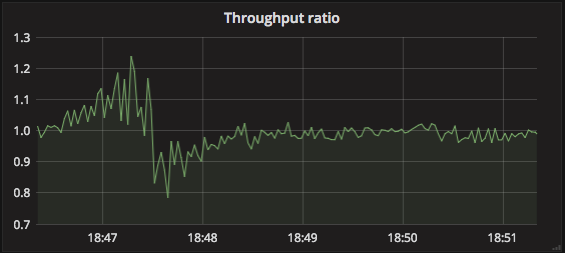
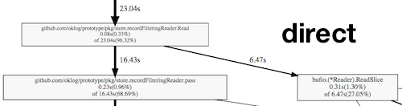
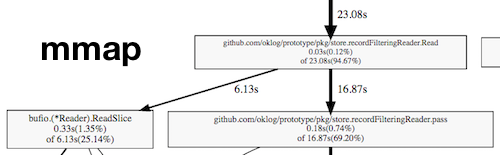
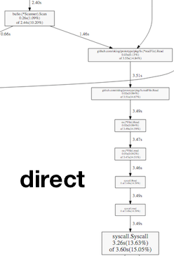
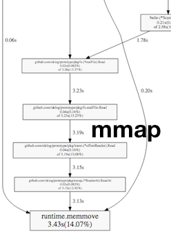

{
    "title": "OK Log",
    "template": "../inc/arbitrary-page.template.source",
	"metadescription": "The design and implementation of OK Log."
}
---

_tl;dr_ — [OK Log](https://github.com/oklog/oklog) is a distributed and coördination-free log management system for big ol' clusters.<br/>
I built it from first principles, to teach myself the gory details of shuffling logs around.<br/>
This is the story of the prototype.

— – -

## Genesis

For the past year or two, I've been giving a lot of talks and workshops about microservices, Go, and Go kit.
Opting in to a microservices architecture means making technology decisions for lots of ancillary concerns.
Where possible, I like to provide guidance in making those decisions, targeted at newcomers with small- to medium-scale infrastructures.
And the open-source landscape is generally pretty huge and rich.
Orchestration? Take your pick: Kubernetes, Nomad, DC/OS, ECS — the list is long, and most options are good.
Service discovery? Consul, etcd, SmartStack, or even solutions like Linkerd can all work well.
Tracing? OpenTracing is the interchange, and implementations like Zipkin, Appdash, Lightstep, Tracer are blossoming.
Instrumentation? Prometheus is the king of the hill.
Logging? Hmm. Here I was stumped!

<div style="float:right; border-left: solid 3px #b34; margin: 95px -180px 120px 20px; padding: 40px 0 40px 20px; width: 200px;"><p style="font-size: 12pt;">
I admit that I'm opining quite heavily here.
Feel free to take me to task <a href="https://twitter.com/peterbourgon">on Twitter</a>.
</p></div>
The defacto answer seems to be Elastic and the ELK stack.
For sure it's featureful, and easy to get started with.
But Elastic has proved to be very difficult to operate at even moderate scale.
And I believe Lucene is perhaps not the best storage format for this class of data — full-text, document-based searching is rarely useful.
Ultimately, while I know plenty of folks who use Elastic, almost none of them are happy with it, mostly due to its operational difficulty.
And few utilize many of its advanced features.

### Something better

I felt like there had to be a better answer for logs.
I asked some of my peers what alternative solutions they had landed on.
Some folks actually use Kafka for this purpose, especially those with higher QOS and durability requirements.
But it's also quite difficult to operate, and ultimately designed to solve a different class of problem than the one I'm most interested in.
Other folks swear by custom systems anchored by HBase.
But managing a Hadoop cluster requires specialized knowledge and extraordinary effort.
Both of these options are, I think, too specific and/or heavy to serve as a good general recommendation.

I broadened the search and [asked on Twitter](https://twitter.com/peterbourgon/status/797256574242680832).
Heka seemed spiritually close, but suffered from design errors upfront, which transformed to unrecoverable performance problems in the end.
It's now been abandoned. Too bad.
Ekanite provides an end-to-end solution, but the syslog protocol seems like a clear impedence mismatch to microservice workloads.
There are good tools for log shipping and annotation, like Fluentd and Logstash.
But they just solve part of the problem; they don't handle storage or query.
Hosted solutions, like Splunk and Loggly, are a great option if you've got relatively low volume and don't mind shipping logs to the cloud.
But they quickly become expensive, and fail to tick the on-prem and open-source boxes.

### Prometheus for logs

I realized what I wanted was a Prometheus for logs.
What would that mean? Well, what's good about Prometheus? In my opinion,

- It's designed to be run yourself: it's both open-source and can be deployed on-prem
- It's designed for "cloud-native" workloads: dynamic, containerized, microservice-y
- It's designed to be easy to operate: local storage, no clustering, pull model
- It's a complete system: doesn't need a separate TSDB, web UI, etc. to get something usable
- It scales up and out: 90% of users are satisfied without special effort

What would a Prometheus for logs look like?
Could building it make for a nice winter project?
I thought it might be fun, and I'd certainly learn a lot!
I started thinking about it more seriously.

## Design

### High level goals

First, like Prometheus, such a system should be open-source and work on-prem.
Most importantly, it should be simple to deploy and operate at scale.
It should have a singular focus on containerized microservice workloads.
And it should be a complete, end-to-end system: forwarders, ingesters, storage, and a way to query.

The principal use case would be application logs from typical microservices: think debug, info, warn, etc.
These are typically high-volume, low-QOS logs, where lower latency (time-to-query) is preferred.
But, we also want to serve so-called event logs: audit trails, click tracking, and so on.
These are typically lower volume, high-QOS logs, where higher latency is acceptable.
Finally, it should be a universal log consumer, managing output from black box systems like MySQL.
That is, logs where we may not have control of the format. 
I believe the same system can serve all of these needs, to a reasonable scale.

With those goals in mind, we can start adding constraints, to make the problem tractable.

### Constraining the problem

Hard-won experience has taught me that a data system like this should focus on reliably shipping data, _or_ adding value to that data.
That is, it should be a transport system, solving more mechanical problems, agnostic to the data being shipped;
 or it should be an application system, providing business value, agnostic to topology and performance requirements.
Attempting to address both concerns with a single solution creates competing tensions, and compromised results.
So I'm interested in biasing toward a transport system, addressing lower-level throughput and latency concerns.
We can add application or business value outside of that system, with separate tools.
For example, contextual annotation can occur prior to ingest.
Or, parsing logs to build aggregates can be accomplished with ETLs, materializing views into data systems with richer query capabilities.

With that in mind, time-bounded grep as the query interface seems totally acceptable.
For new users, who often just want a familiar interface to help them debug — "I just wanna grep my logs!" — it's immediately useful.
And it's totally sufficient for building ETLs into more sophisticated systems.
In effect, it turns the log management system into a basic, intuitive building block.
In my opinion, just what's needed in the space.

### A distributed system

At a Prometheus meetup in San Francisco late last year, Julius Volz observed that log data is orders of magnitude larger than instrumentation.
Prometheus installations in the wild already max out the ingest and storage capacity limits of a single node.
It follows that a log system serving the same niche as Prometheus must be a distributed system.
The complexity seems fundamental and unavoidable.
But, that's fine! We can address it directly and with courage.

### Coördination-free

By far the most important goal is making the system easy to operate.
And from Prometheus, we learn that it should scale up smoothly, from test drives on laptops to prod, without major structural changes.
But there is a tension here, between this desire for simplicity and the complexity inherent in distribution.
There are many ways out of this cave, but I strongly favor coördination-free systems.
(If this will be a hobby project, it should be fun!)
Coördination-free means giving up a lot of techniques that systems like Elastic, Kafka, Cassandra, etc. leverage to great benefit.
No master election. No knowledge of allocations. No shard table. No distributed index. No vnodes.
Acknowledging that paused, partitioned, and dead nodes are all part of the game.
In some sense this makes the system design harder, in that we have fewer techniques to leverage, and need to spend more time designing upfront.
But in another sense it makes it easier, as coördination-free components tend to be simpler to wrap our heads around, and easier to implement.

Let's see if we can design a component model that's coördination-free.
I'll walk through my thought process more or less as it happened.

### The importance of writes

Before we get started, one important observation: writes are in the hot path, whereas reads can wait.
Thus, I think the most important runtime challenge is to accommodate high write throughput.
Ideally, we'd achieve close to hardware limits — which also helps reasoning about scale and capacity planning.

This begins to imply a design.
Agents will forward log records from containers to ingesters.
The ingesters should perform fast sequential writes to an active segment file, and nothing more.
Let the storage nodes worry about optimizing for the read path.


### Ingestion

Since we have different performance requirements for ingestion vs. querying, it makes sense to separate those components.
They can be colocated for small or trial installations. 
We can also make it easier by shipping a single binary.

At write time, each record can be assigned a unique identity by the ingester.
This opens up a lot of possibilities regarding at-least-once delivery and record deduplication in the future.
For this, a time UUID, or [ULID](https://github.com/oklog/ulid), serves well.
It's important that each record have a timestamp with reasonable precision, to create some global order.
But it's not important that the clocks are globally synced, or that the records are e.g. strictly linearizable.
Also, I think it's fine if records that arrive in the same minimum time window to appear out-of-order, as long as that order is stable.
It turns out ULIDs can be generated on the order of 50ns. This works.

To address the spectrum of durability requirements, there can be different, opt-in durability modes.
If we care primarily about throughput, e.g. for application logs, we can use a fast mode, which writes to a file descriptor without explicit syncing.
And for e.g. event logs, there can be a durable mode, where we regularly sync the active segment to disk.
Finally, we can have a bulk mode: clients write an entire segment file at once, which is only acknowledged when it's fully replicated to other nodes.
(Inspiration here taken from Kafka.)

Our component model takes shape.


Let's think a bit about the issue of coördination.
If we arrange it so that any ingest node is able to service any record from any forwarder,
 we avoid forwarders needing knowledge about ingesters beyond their address.
Forwarders are free to connect to any ingester in the pool,
 and can implement backpressure, buffering, reconnect logic, etc. depending on the requirements of their concomitant service.
With those constraints, ingestion can be coördination-free. 
So far so good.

### Replication

What is written to a disk is not yet safe!
Once persisted, records should be replicated.
And we know that our data volume requires multiple storage nodes.

Taking a cue from Prometheus, we invert typical replication from push to pull.
Concretely, all ingest and storage nodes join a cluster, and gossip knowledge of each other.
All storage nodes consume segments regularly and randomly from all ingest nodes.
Consumed segments are merged and, after they reach a certain age or size, replicated across other storage nodes.
Only once they are successfully replicated are the original segments confirmed and cleared from the ingest nodes.


<div style="float:right; border-left: solid 3px #3b4; margin: 30px -180px 20px 20px; padding-left: 20px; width: 200px;"><p style="font-size: 12pt;">
I guess this is the main thing to wrap your head around.
The ingesters just accept writes as quickly as possible.
The store nodes consume those records and make them queryable.
</p></div>

In effect, we turn each ingest node into a sort of dumb, disk-backed queue.
And each store node gets a random subset of the overall corpus, with density determined by replication factor.

Why go through the trouble of moving data from the ingest nodes to the store nodes?
In smaller installations, with low read and especially write loads, it may indeed be pointless.
For those situations, e.g. when testing locally, we'll provide a hybrid ingest+store node.
But for larger installations, my hope is that I/O will be the primary bottleneck,
and the ingest workload (sequential writes) competes with the store workload (semi-random reads and writes).
It seems smart to isolate them.

During a replication transaction, any failure (or timeout) simply causes a transactional abort, and the ingester segments will be re-consumed later.
This can result in duplicate records, but that's fine, as records are deduplicated in any case at query time, via their ULID.
In effect, we've built at-least-once delivery.
This form of replication is transactional, but otherwise coördination-free.

### Elasticity

Observe that the ingest tier is effectively a distributed, disk-backed queue of log records.
We can scale the ingesters as necessary to handle our write volume.
And we can scale the storage tier to handle our replication factor, retention period, and read volume requirements.

Adding nodes to either tier is as simple as having them join the cluster and starting work.
As an optimization, ingest nodes can gossip load information, and practice load shedding with hysteresis to balance writes.
Storage nodes automatically start consuming a co-equal share of ingest segments from ingest nodes.
As long as ingest segment size << storage segment size, this balances write load immediately.
And disk utilization is balanced over the retention window.
All of this happens without explicit member registration, keyspace claims, or any form of consensus.
Growing and shrinking the cluster is coördination-free.

### Compaction

Storage nodes end up accumulating segment files of heterogeneous size and time range. 
Compaction is the process of shuffling, merging, and re-splitting these segment files to optimize them for queries.


Compaction can merge overlapping segments, as pictured, as well as combining small, sequential segments.
In each case, it makes stepwise progress toward uniform segment distribution, which is what we want for time-bounded queries.
Also, the compacting agent can be used to enforce retention periods.
Observe that the dataset remains the same, only the layout on disk is optimized.
The effect of compaction is transparent, pure-local and thus coördination-free.

### Query

Querying is literally time-bounded grep.
We'll scatter each query to all query nodes, gather results, and return merged and deduplicated records to the user.
Per-record ULIDs provide sortable identity for deduplication.
Could it be made more efficient by somehow reading from fewer nodes?
Yes, certainly — but that would involve prior knowledge about segment location/allocation, which requires some form of coördination.
We deliberately make the read path dumb, and pay some costs of inefficiency, to keep it coördination-free.

## Prototype

### Implementation

With the help of some friends, I sketched out the system design in progressively more detailed iterations.
And that was a lot of fun!
[Designing coördination-free distributed systems is one of life's great pleasures.](https://twitter.com/peterbourgon/status/803693532988981250)
After several rounds over several weeks, I managed to convince myself that the thing was potentially viable.
So over the holiday break, I started an implementation.
After a week or so, I had a prototype that seemed correct and usable.
Time for some stress testing!

### Validation

Now I'll describe the process of validating and profiling the system with successive system and load tests.
The test environment was provided by [DigitalOcean](https://www.digitalocean.com), many thanks to them!

I created a set of 8 forwarder nodes, 3 ingester nodes, and 3 storage nodes.
I started with some basic correctness and crash testing, and was quickly overwhelmed with spammy logs from each of the components.
It was very difficult to reconstruct state, or draw meaningful conclusions, from that log spam.
I ended up removing a boatload of log statements, and adding a lot of metrics.
Constructing Prometheus expressions and reading graphs was a much more effective way to build insight.
In the end, I only ended up logging some runtime parameters at startup, and clear errors, like failure to write files.
I'm acutely aware of the deep irony at play here.

### Typical throughput

The first thing I wanted to optimize was throughput.
To satisfy my own curiosity, I did [a Twitter survey](https://twitter.com/peterbourgon/status/811985708017709056)
 of typical log volume among my peers.
I was interested in log egress volume per node in a cluster.
The results varied wildly, from 1KBps to 25MBps (!) — though that high number was something of a structural outlier.
It seemed like 5MB/sec/node was a good target for an 80% or 90% solution.
Let's call that our typical use case.

DigitalOcean disks apparently [do up to 250MBps sustained write](http://martin-denizet.com/digitalocean-vps-ssd-benchmark/),
 which I understand is considered quite good for the cloud.
In my own testing, I got a bit less; a reliable low watermark of 150MBps.
If we design everything correctly, this should be our bottleneck.
So a single ingest node should be able to handle writes from 150/5 = 30 to 250/5 = 50 typical cluster nodes.
That seems like a reasonable fan-in factor.
And our cluster of 3 ingest nodes should be able to handle about 3x150MBps = 450MBps aggregate ingest.
Targets set.

### Optimizing forwarding

The forwarder is little more than netcat.
It's basically

```
conn, _ := net.Dial("tcp", ingesterAddress) // make a connection
s := bufio.NewScanner(os.Stdin)             // tokenize by line
for s.Scan() {                              // read a line 
    fmt.Fprintf(conn, "%s\n", s.Text())     // write a line
}
```

Go's [bufio.Scanner](https://golang.org/pkg/bufio#Scanner) is actually great here; whatever limits I hit, they weren't imposed by the scanner.
But I had some (in hindsight, silly) inefficiencies in the little fake microservice I was using to generate log records.
I observed considerable CPU burn, and much lower egress rates than expected.
Profiling revealed two problems.
First, I was using a time.Ticker in a hot loop, one tick per log line.
Effectively

```
hz := time.Second / recordsPerSecond
for range time.Tick(hz) {
    // emit 1 record
}
```

When you want to emit 1000 records per second, blocking on the ticker for 1ms is pointlessly wasteful.
I amended that slightly to print records in batches.

```
var (
	recordsPerCycle = 1
	timePerCycle    = time.Second / recordsPerSecond
)
for timePerCycle < 50*time.Millisecond { // chosen arbitrarily
	recordsPerCycle *= 2
	timePerCycle *= 2
}
for range time.Tick(timePerCycle) {
	// emit recordsPerCycle records
}
```

Also, I was building each log line, of random data, within the hot loop, and burning lots of CPU in math.Rand to do it.
Precomputing a large, fixed set of random log lines at program start solved that one.
With those changes, I could easily push plenty of MBps second from each process with negligible load.

I set up between 1–8 forwarders per forward node, times 8 ingest nodes, for 8–64 forwarder processes in total.
Each process would do 100–1000 records per second, times 100–8000 bytes per record, for up to half a gigabit per second of production capacity.
That'll do.

### Optimizing ingestion

In the beginning I was quite concerned about assigning a ULID per record.
But thanks to [Tomás Senart's](https://twitter.com/tsenart) excellent work with the [ULID library](https://github.com/oklog/ulid),
 these costs were actually quite low, on the order of 50ns per ULID, as we don't need crypto-grade entropy.

```
BenchmarkNew/WithoutEntropy-8    30.0 ns/op  534.06 MB/s  1 alloc/op
BenchmarkNew/WithEntropy-8       65.8 ns/op  243.01 MB/s  1 alloc/op
BenchmarkNew/WithCryptoEntropy-8  771 ns/op   20.73 MB/s  1 alloc/op
```

I was initially able to push to about 30 MBps into each ingest instance, but then things got screwy.
Initial profiling revealed disproportionate CPU burn in [bytes.FieldsFunc](https://golang.org/pkg/bytes#FieldsFunc) and syscalls.
FieldsFunc I was using to extract and compare ULIDs, which was surprisingly inefficient.
Switching to splitting on fixed-sized offsets — ULIDs give us that ability — improved benchmarks, but not ingest rates.

Turning my attention to the syscalls, I suspected filesystem contention.
To verify, I abstracted the filesystem, and provided a no-op implementation.
This worked much better, scaling to hundreds of MBps ingest.
It turned out that in the initial design, I was muxing all incoming connections to the same active segment file.
My thought was to optimize (minimize) the number of active segments produced by each ingester,
 under the assumption that transferring segments to the stores would be a bottleneck.

But profiling revealed the muxing itself to be more costly.
So, I split it out so that each connection wrote to its own segment file.
This was the major win. 

Active segments are closed once they hit a certain age or size.
The age limit keeps the system fresh, the size limit keeps replication manageable.
If we close based on age, we have low volume, and things are easy.
We can choose an age based on desired record latency; 3s is the sane default.
But if we close based on size, we have high volume, and we must balance two concerns.
Files should be big enough to amortize replication overhead and [efficiently utilize typical SSDs](http://codecapsule.com/2014/02/12/coding-for-ssds-part-5-access-patterns-and-system-optimizations/),
 but small enough that they can be quickly transferred, and effectively composed into storage tier segments.
I chose 16MB as the default target size for ingest tier segments,
 and 128MB as the default target size for storage tier segments.
But these choices aren't necessarily universal!
They can dramatically affect system throughput, and should be validated in your particular environment.

With ingest nodes happily consuming and persisting records, I turned to the storage nodes.

### Optimizing replication

Replication works like this.
Once an ingested segment is closed, due to age or size, it becomes available to the storage tier.
Store nodes poll random ingest nodes, and take the oldest available segment.
They merge that segment into an aggregate segment in memory.
They do this in a loop until the aggregate segment has reached, again, a certain age or size.
Then, they replicate that segment to N random store nodes, where N is your desired replication factor.
Once replication is confirmed complete, the ingest segments are confirmed and deleted.

In practice this worked well.
Even when ingestion was really unbalanced, the storage nodes evened things out.



The stores move through a state machine to consume segments: gather, replicate, commit.
The gather state required a little tweaking to consume things as quickly as possible.
(Of course, polling sucks, it's much better to subscribe. Future work.)
The replicate state basically POSTs the aggregate segment to other nodes.
It's important to amortize the cost of that POST with a sufficiently large segment.
(We could also optimize by always choosing ourselves as one of the target nodes. More future work.)

The measure of success here is how deep the queue gets on the ingest nodes.
Or, put another way, the ratio of bytes consumed by stores to bytes received by the ingesters.



A steady state of 1 is desirable.
Higher than 1, and we're consuming more than we're ingesting; maybe chewing through a backlog?
Lower than 1, and we're not consuming fast enough; better add more store nodes!

The initial, somewhat naïve implementation proved stable in practice.
Of course there are lots of opportunities for efficiency gains, but no major problems were detected.
I was satisfied the system as a whole could handle appropriate ingest rates.
But can it be queried?

### Optimizing queries

This was the real test! 
The exercise is pointless if queries are unusably slow.
And initial benchmarks were quite scary: much worse than expected.
Still, there was lots of low-hanging fruit to be plucked.

The initial "grep" design was very naïve.
We would find matching segments, throw them into a [K-way merge](https://en.wikipedia.org/wiki/K-Way_Merge_Algorithms), reading record-by-record.
And we'd attach a single time-bounds and query-expression filter to the output of that merge.


Tomás observed that, in a perfectly compacted system, there would be no overlap of segments.
In this situation, there's no need to burn CPU doing a global merge.
We can read nonoverlapping segments straight through, sequentially, and just merge the overlapping segments.
So, I implemented a MultiReader, composed of plain file readers or merge readers, depending on segment overlap.


This provided a good speedup, up to 50% faster in some cases.

Then we gathered some profiling data, which revealed CPU burn in syscalls, the record filtering pipeline, and regexp matching.
We thought explicit mmapping of files might provide a big boost to read performance, so we prototyped an mmapping filesystem abstraction.
But we didn't see significant gains.
Compare the profiles of the direct filesystem to the mmapped filesystem.

<br/>


Almost exactly the same time was spent filtering records vs. reading them from the disk.
It's just that in the direct filesystem, the read costs are syscalls; in the mmap filesystem, they're memmoves.




Turns out the page cache is pretty effective!

After a day or two of thinking, I realized that the order of operations was merge, and then filter.


But that makes us burn a lot of CPU merging potentially irrelevant records.
And since merging must establish a sort of transaction-global order, it's constrained to a single core!
If we instead filter first, we can do it concurrently, and only merge post-filtered records.


Making those changes showed over 2x speedups in query speed, and much better CPU utilization. Great!
But blocking profiling revealed a huge amount of time waiting in the per-segment goroutine's write to an [io.Pipe](https://golang.org/pkg/io#Pipe).
If we could buffer that pipe, we'd be doing well.
Unfortunately, io.Pipe doesn't give you a way to drop in an intermediating buffer.
Fortunately, we found the [djherbis/nio](https://github.com/djherbis/nio) package, which provides a buffered Pipe with the same semantics.
Dropping that in with a modest 1MB buffer showed another 2x speedup! Amazing!

Satisfied, we turned our attention to the regexp costs within the filters.
Switching to [bytes.Contains](https://golang.org/pkg/bytes#Contains) showed reasonable improvement.
It turns out that's even [assembly optimized](https://golang.org/src/runtime/asm_amd64.s#L1920) — nice!
So we made that a query-time flag: opt-in to regexp matching only if you need it.
(A further optimization might be using PCRE regex; future work.)

<div style="float:right; border-left: solid 3px #34b; margin: 30px -180px 40px 20px; padding: 10px 20px 10px 20px; width: 200px;"><p style="font-size: 12pt;">
Of course, basically all of this work is just following the well-worn paths of database optimization.
But sometimes it's important to navigate these paths ourselves! :)
</p></div>
At this point we realized our current working set (about 21G) exceeded the memory on the store node (8G).
If we could get more memory, we could load the whole working set via the page cache, and hopefully suss out any other inefficiencies.
We booted up a big 32G DigitalOcean droplet, including more cores to aid in concurrent filtering.
Initial tests with no other changes gave us another 2x speedup. Nice.

Prior experience [tuning Cassandra](https://tobert.github.io/pages/als-cassandra-21-tuning-guide.html) gave us some more ideas.
We tweaked the I/O scheduler and readahead settings, which gave us another 20% improvement.
Though, at this point, we were getting pretty close to just benchmarking the memory bus on the nodes.
We were reliably querying a 20973708 KB corpus in 4.6 seconds, for a read throughput of 4.47 GBps.
There may be additional work here, to optimize disk access, but this seemed totally adequate for a first pass.

## Version 1

That's the system as it exists today!
[You can find it here](https://github.com/oklog/oklog).
What work remains to be done?

### Future work

We can, and should, perform read repair, similar to Cassandra.
That is, records returned by a query should be equally duplicated among store nodes.
Those that aren't can be detected, batched, and rewritten to nodes that don't have them.
Compaction will put them in the right place eventually.
That's [issue 6](https://github.com/oklog/oklog/issues/6).

Relatedly, the overall system can tolerate (replication factor - 1) failed store nodes before losing data.
But if a store node fails completely, we're operating in a degraded state unless some kind of repair process occurs.
A kind of timespace walker process — essentially a repair process — could be written, and invoked when a node fails.
It would sequentially query each log record, to trigger read repair for those records that are under-replicated.
This, or something like it, is [issue 11](https://github.com/oklog/oklog/issues/11).

Adding a new ingester node is pretty seamless.
New clients will just connect to it, stores will just consume from it — no big deal.
But ingesters could gossip their instantaneous load amongst each other, e.g. connected clients, throughput, etc.
Somewhat highly-loaded ingesters can begin suggesting lightly-loaded ingesters to new clients when they connect.
Clients, i.e. forwarders, can be nice and respect those wishes if they are able.
Very highly-loaded ingesters can refuse new connections for a period of time.
And extremely highly-loaded ingesters can both refuse new connetions and boot existing connections, if necessary.
All of this is OK, given forwarders will reconnect to another ingester in the cluster.
It's important to be careful with this: applying hysteresis, never have more than X% of ingesters refusing connections at once, etc.
This ingest tier balancing is [issue 2](https://github.com/oklog/oklog/issues/2).

Similarly, adding a new store node also works just fine.
It will start consuming a proportional share of segments from the ingester nodes.
Over the retention window, this will even out equally.
But until that window is elapsed, the new store node will have a smaller share of segment files versus other store nodes.
As an optimization, it could gossip its current data set size with other store nodes.
When replicating, store nodes can bias in favor of nodes with a smaller share of the overall data set size
Newer store nodes will receive more replication writes; older store nodes will receive fewer replication writes.
This gradual rebalancing strategy reflects my belief that leaving data at rest whenever possible is desirable.
I've observed plenty of outages caused by segment/shard/node rebalancing after a big topological change.
I think this can work, but it remains to be seen if it's truly viable.
This storage tier balancing is [issue 3](https://github.com/oklog/oklog/issues/3).

The failure modes are thought-through, but not empirically validated.
I'm interested to build a testing harness for failure modeling, in the style of a simplified [Jepsen](http://jepsen.io/).
Also, it would be good to establish a means to verify overall system throughput (MBps) and latency (ingest-to-query).
That testing work is [issue 14](https://github.com/oklog/oklog/issues/14).

Early on in the design process, I observed that queueing theory applies, here.
I'd really like to model the system, in the style of
 [Adrian Cockcroft's microservice response time distribution analysis](http://www.slideshare.net/adriancockcroft/microxchg-analyzing-response-time-distributions-for-microservices).
I started laying the groundwork for this, but didn't quite have the chops, or time, to follow it up.
That modeling work is [issue 9](https://github.com/oklog/oklog/issues/9).

That's really just the beginning; there are plenty of other low-hanging fruits to be plucked.
The [issues list](https://github.com/oklog/oklog/issues) probably has another month or two of work queued up.

## Conclusion

Will this be useful to anyone? I don't know! Maybe!
If it sounds appealing, please try it out, or reach out to me to discuss applying it in your environment.
If not, oh well! It was a ton of fun to build and I learned a lot.
And maybe this journey, or its lessons, will be useful by itself.

— – -

_Massive thanks to Tomás Senart for his expert consultation and assistance.
 Many critical performance optimizations, especially in the read path, are entirely his work.
 The project would likely have been abandoned were it not for his contributions and encouragement.
 Also, thanks to Sean Braithwaite, Fabian Reinartz, and Omid Aladini.
 Their insights and comments materially improved the design.
 Thanks also to David Kaltschmidt for reviewing a draft of this document._

_[Go back to my website](/), or [Tweet atcha boy](http://twitter.com/peterbourgon)._
