{
    "template": "../inc/arbitrary-page.template.source",
    "title": "SALE SALE SALE"
}

---

A pre-winter purge event! The great purge!
If you want to buy something just email me, peter@bourgon.org.
We can arrange a time for you to come pick it up.
If you buy lots of things at once I will give you discounts.

 
## ⛺️ CAMPING

### Moorhead Rapido II tent — €30

[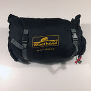](tent-1.jpg)
[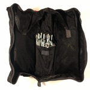](tent-2.jpg)

This is a super simple two-pole tent that sleeps two comfortably.
It's got an attached rain fly, sort of an automatic two-layer system that keeps you super dry.
Also, a nice reinforced bottom layer, zip windows, and a little vestibule in the front.
[Here's a video of it being set up and torn down](https://www.youtube.com/watch?v=KSi34rBtVsA).
It was used at festivals for a few years, always studiously cleaned afterwards, and has been sitting in storage for awhile now.
Packs down into a really compact little carrying thing, about 30cm x 15cm x 10cm.
And comes with a full set of upgraded aluminum tent pegs.
This was generally the most secure, spacious, and comfortable tent among my friends.

### Explorer Light 600 sleeping bag — €5

[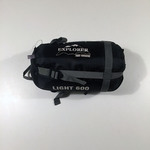](sleepingbag-1.jpg)
[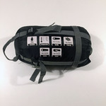](sleepingbag-2.jpg)

This is an inexpensive and extremely lightweight polyester sleeping bag that's actually very cozy.
It's great for summer festivals, and could even be put to use for late spring or early fall camping.
Comes with a cinching bag.

### Thermarest Trail Light regular sleeping mat — €30

[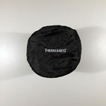](thermarest-1.jpg)
[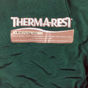](thermarest-2.jpg)

[Product page](http://www.cascadedesigns.com/therm-a-rest/mattresses/trek-and-travel/trail-lite/product).
I'm not exaggerating when I say this is the best camping-related purchase I've ever made.
Sleeping on this thing is unbelievably comfortable.
With a good pillow and a reasonable sleeping bag, you'll catch so many sweet Zs.

### Camp stove & pots — €15

[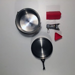](stove-1.jpg)
[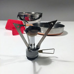](stove-2.jpg)
[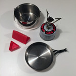](stove-3.jpg)
[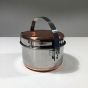](stove-4.jpg)

This is a little camp stove that you attach to a canister of red-type natural gas.
Then you light it, and you have some heat for cooking, boiling water, whatever you want!
The included pot and pan are very lightweight and they all kind of pack together.
I used it to heat up prepackaged couscous-type meals, soups, and make tea and coffee.
You could even fry an egg on it!
Note: does not include the gas canister, but they're cheap and available at any camp store.

### Two floaties — €5

[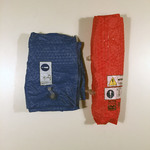](floaties-1.jpg)
[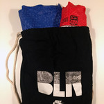](floaties-2.jpg)

These are two little inflatable rafts that you can use at the lake.
They come in a handy carry sack with a Nike logo on it.
I used them at Melt! festival in the lake. And also at Leipnitzsee a couple of times.

### Camping Combo Package — ~~€85~~ €60

Camping combo package!
Get the tent, sleeping bag, sleeping mat, and camp stove & pots, and the two floaties all together and save big Eurobills.
Perfect for the next festival season — be the envy of your festival friends.

 
## 👜 BAGS

### Heimplanet Monolith Rucksack 45L — €150

[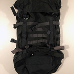](backpack-1.jpg)
[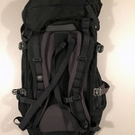](backpack-2.jpg)

[Product page](https://www.heimplanet.com/shop/Monolith-Rucksack-45-L-pine-green).
I bought this rucksack online in September, but quickly realized it didn't suit my purposes.
I used it twice, both times time to carry groceries back from the supermarket.
So it's effectively brand new.
It's also much greener in real life than it looks in my pictures.

### Timbuk2 messenger bag — €40

[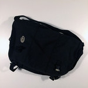](timbuk2-1.jpg)
[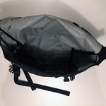](timbuk2-2.jpg)

Classic 3-panel design, black/black/black with white logo.
Size medium. Waterproof as all heck.
Bought this almost 10 years ago, so it's got a few scruffs, but no damage to speak of, and it's still tough as nails.

### Muji Boston bag — ~~€25~~ <em>RESERVED</em>

[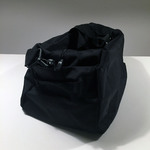](bostonbag-1.jpg)
[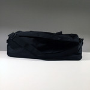](bostonbag-2.jpg)
[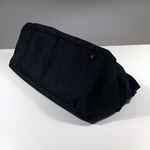](bostonbag-3.jpg)

[Product page](http://www.muji.de/en/store/goods/4945247041132).
I bought this size large Boston bag from a Muji store, when I needed to bring some extra stuff back to Europe on a trip.
So it was used once, and has sat in my closet since.
It's a really nice bag! It's strong and minimal and the detailing is great.

### Fjällräven Kånken bag, small — €15

[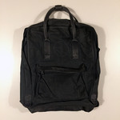](kanken-1.jpg)

This is the famous small Kånken bag that everyone seems to have, in dark grey.
I took the Fjällräven logo off with a seam ripper, so now there's a cool little circle there.
It's seen some shit, so there's a few scruffs and a couple of small punctures, which I've photographed.
But that's authenticity! No structural damage.

### Custom leather messenger bag — ~~€30~~ <em>RESERVED</em>

[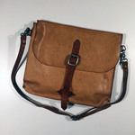](leatherbag-1.jpg)
[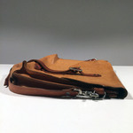](leatherbag-2.jpg)
[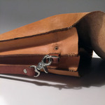](leatherbag-3.jpg)

I had this leather messenger bag custom made by a guy in Boston in 2011.
It's served me many seasons and has the wear to prove it.
It's a classic two-compartment design, big enough for a 13" laptop and a couple of books.
It's got a nice skinny strap and smells lovely.

### Muji packable duffel bag — ~~€15~~ <em>RESERVED</em>

[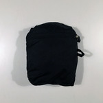](packable-1.jpg)
[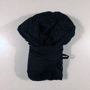](packable-2.jpg)
[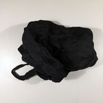](packable-3.jpg)
[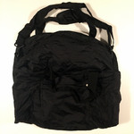](packable-4.jpg)
<!--
[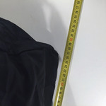](packable-6.jpg)-->

Like the Boston bag, I bought this when I was on a trip and needed to bring some extra stuff back.
I checked it and it survived pretty much unscathed and I haven't used it since.
It's super light and packs down into its own pocket! That's neat.
Total volume is about 25cm x 25cm x 50cm.

### Muji collapsable suitcase — ~~€75~~ <em>RESERVED</em>

[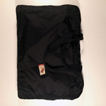](suitcase-1.jpg)
<!--[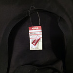](suitcase-2.jpg)
-->[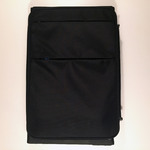](suitcase-3.jpg)
[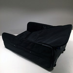](suitcase-4.jpg)
<!--[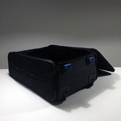](suitcase-5.jpg)
-->[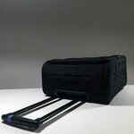](suitcase-6.jpg)
<!--[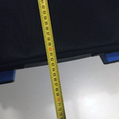](suitcase-7.jpg)
[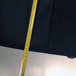](suitcase-8.jpg)
[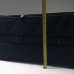](suitcase-9.jpg)-->

This is a really cool black wheeled suitcase that deconstructs and folds flat.
And it comes with a little storage bag to store it in, with the original tag!
I used this a couple times flying around the world.
Typical Muji quality, it's strong Cordua nylon and really great zippers and solid wheels.
I really shouldn't be selling this, to be honest.
About 62cm x 47cm x 26cm.

 
## 🔌 ELECTRONICS

### IKEA LED light bulbs — €10

<!--[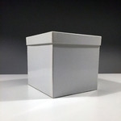](bulbs-1.jpg)-->
[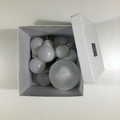](bulbs-2.jpg)

[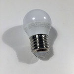](bulbs-4.jpg)
[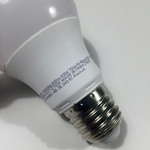](bulbs-5.jpg)

What's in the box?? It's a box full of LED light bulbs!!
Why do I have so many light bulbs?
I have poor impulse control in IKEA!
They're all E27 connectors.
Two little 200 lumen ones with a nice yellow color.
Seven normal-sized 400 or 600 lumen ones with a slightly whiter color.
One big one that doesn't have any markings so I forget what it is.

### IKEA LED lamp — €10

[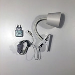](lamp-1.jpg)
[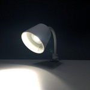](lamp-2.jpg)

This is a nice IKEA clip-on LED lamp that's rated for like ten thousand hours of low-energy operation.
I think I've used it for about 24 hours.
It's got a bendy neck so you can point it right at whatever's dark.

### Jawbone Big Jambox — €25

[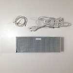](jambox-1.jpg)
[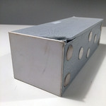](jambox-2.jpg)
[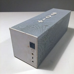](jambox-3.jpg)

This thing was consistently rated among the best Bluetooth speakers in terms of loudness and sound quality.
I can confirm it is both loud and sounds great.
I used it for a long time as the only speaker in my quite large apartment, it worked well.
It also survived quite a bit of party and park duty, which is why it's rather banged up.
But the damage is purely aesthetic, it still works and sounds great.
The battery also pumps out the jams for easily 10 hours between charges, amazing!

 
## 👞 FOOTWEAR

### Red Wing Iron Rangers EU44 — ~~€200~~ <em>RESERVED</em>

[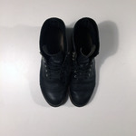](boots-1.jpg)
[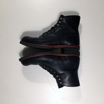](boots-2.jpg)
[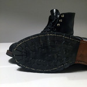](boots-3.jpg)
[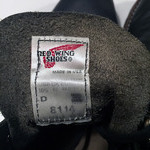](boots-4.jpg)

I love the look of these classic American work boots.
I even had them re-soled with proper lugs, to cope with the Berlin winter.
They are excellent, strong, built-to-last boots.
But, after wearing them off-and-on for a couple seasons, I realized they just don't suit my foot shape.
It is with great sadness that I part with them.
They are a little bit worn, maybe they have one real season's worth of wear on them.
And they have a new insole that's been used perhaps three times.

### Rubber wellies EU45 — €5

These are some black rubber wellies I bought at the hardware store.
I wore them to a couple of rainy festivals and cleaned them studiously afterwards.
They work great! No holes. Very comfy (for wellies).

 
## 🏉 RUG

### IKEA Tånum rug — €5

[Product page](http://www.ikea.com/de/de/catalog/products/30307485/).
IKEA Tånum flat-woven rug, 70cm x 180cm. It's kind of a long skinny one.
I bought it as a backup rug. Why do I need a backup rug? I don't. Never used.
